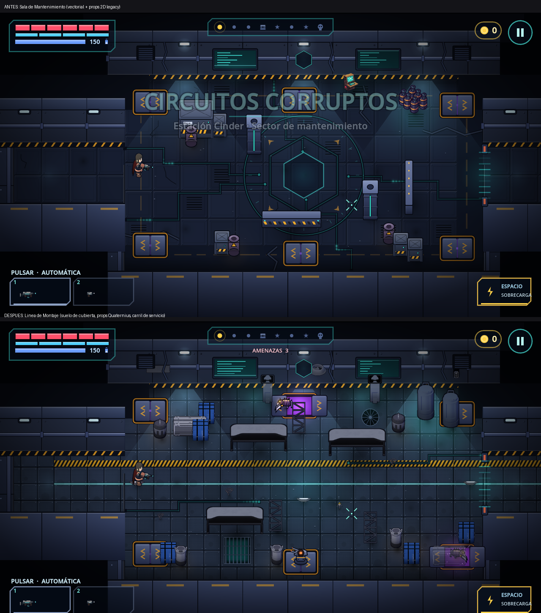

# Capítulo 1 — sala premium "Línea de Montaje" (2026-10-10)

Rama `feat/premium-rebuild-slice-20261010`. Sin cambios en combate, generación, progresión, RoomBake, armas, guardado ni controles.

Combate real (bot, Vesper, enemigos del capítulo): `review/2026-10-10/combat/`. Salas antiguas del capítulo con el mismo suelo/props: `review/2026-10-10/other/`.

## Qué cambió
- **Sala nueva `assembly_line`** (`data/content/content_dungeons.gd`), compuesta (sin gemelo reverso), ya en el pool de ch1. 22 props con colisión: 6 destructibles (cajas/barriles), 8+ coberturas sólidas (mesas bajas, soportes, tanques, cajas grandes), terminales contra el muro norte. **Carril central de servicio** (franja de luz + franja de peligro) libre entre entrada y salida; spawns en las 4 esquinas + norte/sur. Los tests de geometría existentes (`tests/test_rooms.gd`) validan spawns libres y alcanzables y pasillos no bloqueados.
- **Suelo de cubierta** (`tools/premium_tech_floor.py`): 9 placas originales de 192 px (96 px de juego), rejilla alineada al mundo (una fila centrada en y=0), zonas por sala `decor.deck_zones` en coordenadas reales (no se compactan con `COMPACT_K`). Todo se hornea en RoomBake. Sin los PNG, el suelo vectorial anterior sigue funcionando.
- **Props del tema tech** (`VisualProfiles.PROPS_THEMED["tech"]`): cajas, barriles, tanques, terminal, pilares y barreras de **todas** las salas del capítulo 1 usan ahora arte Quaternius pre-renderizado; si falta, cae al dibujo vectorial (`Prop.__draw_impl`).
- **Muro norte**: `decor.wall_items` (ventilación, ventilador, punto de acceso) y luces localizadas `decor.lights` (baked + pulso de alarma), `decor.authored` (cables, luces de suelo, mina, tubo de salud).
- **Herramientas**: `--room=<id>` (solo revisión visual) en `run_director.gd`; jobs `tech_modular` / `tech_essentials`.

## Medido (render local GL sobre D3D12, no es Android)
| sala | draw calls | primitivas | FPS medio (sin combate) |
|---|---|---|---|
| maintenance (nuevo estilo) | 511 | 11841 | 64.3 |
| assembly_line | 502 | 10455 | 66.6 |
No hay evidencia de regresión; **no** se midió en el Moto edge 60 Pro.

## Pruebas
`tools/check_all.sh`: TODO OK (5572 comprobaciones GDScript, 0 fallos; regresión Android Python; humo bot ch1–ch4, supervivencia, bossrush, desafío). `check_premium_art.py`, `test_premium_pipeline`, `test_playground_bank`: OK. Partida bot completa de ch1 con `--room=assembly_line` forzada en las 8 etapas: victoria. Nuevo `tests/test_ch1_premium.gd`. **No** se ejecutó exportación Android ni apertura en dispositivo/emulador.

## Materiales
Usados: Quaternius Sci-Fi Essentials y Modular SciFi MegaKit (CC0). Playground: no se usó ningún recurso nuevo en esta iteración (los fondos de capítulo siguen solo en el menú). **Pendiente**: muros 3D (los de Modular SciFi dependen de normal maps), jefe del capítulo, recentrado de enemigos/jefes Playground, props Playground (props_* son candidatos `ready_to_adapt`), sala de jefe `core_arena` y sala de caché `vault` con el nuevo estilo, audio. Todos los originales siguen intactos en `asset_bank/`.

## Límites conocidos
- Los pilares/soportes son esbeltos; los tanques usan un modelo de barril grande (no hay tanque dedicado).
- Los props de la sala antigua `barrier_v`, `rack`, `reactor` siguen siendo arte anterior; mezcla visible junto a los nuevos.
- La captura "antes" incluye el cartel de capítulo (tomada a 2 s); la "después" a 4.5 s.
