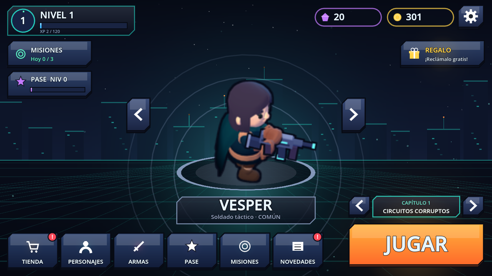
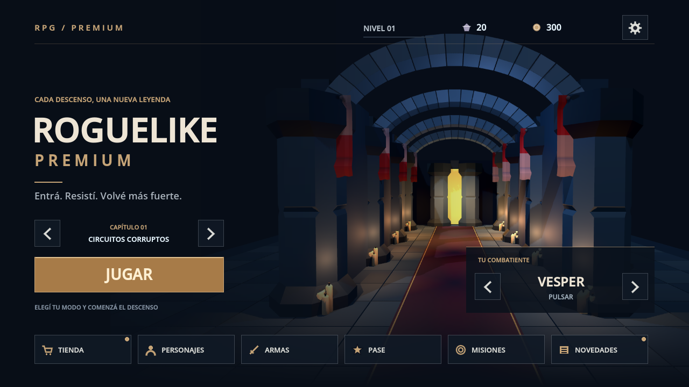
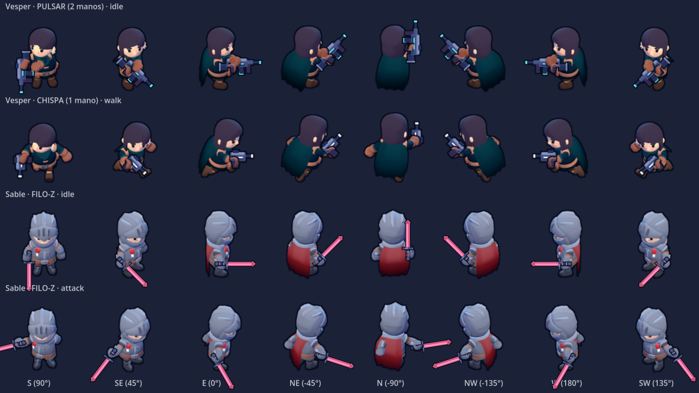
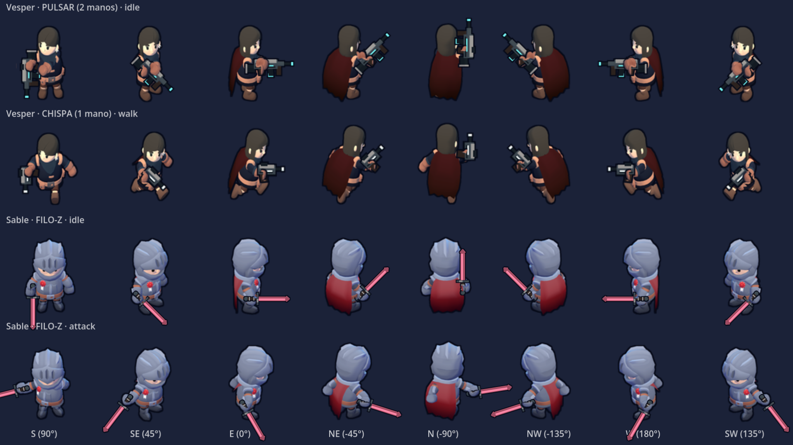
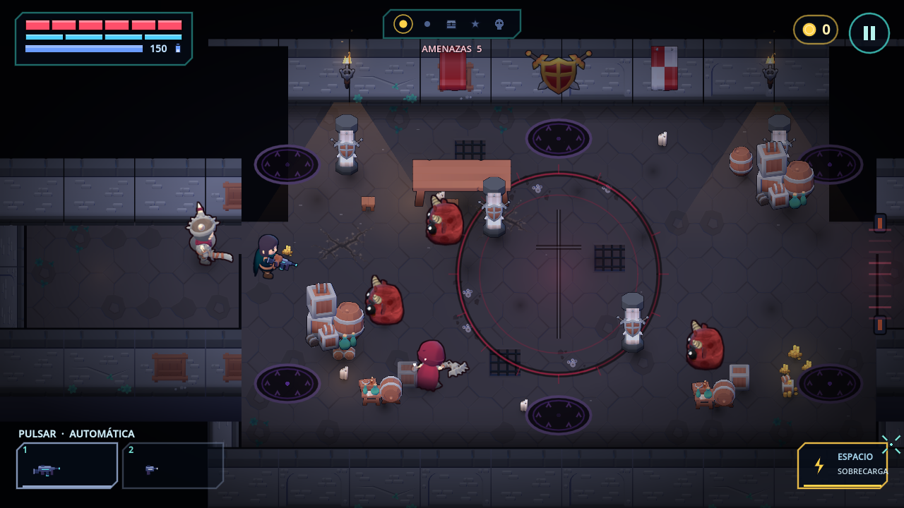
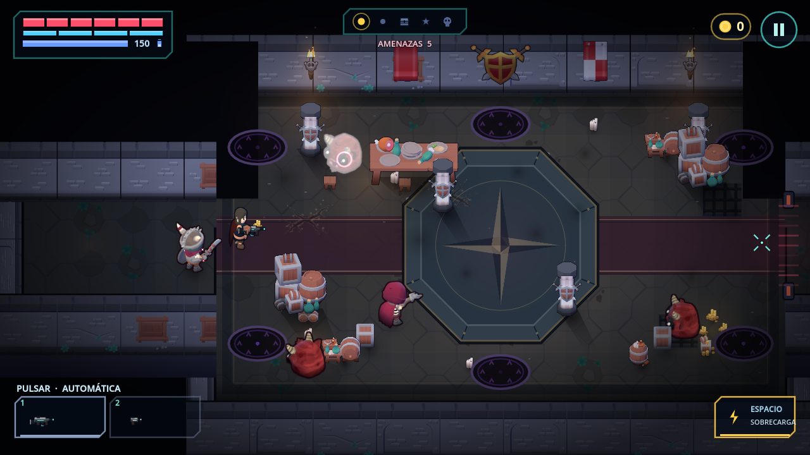

# Revisión visual — portada, Vesper y Patio de Armas

Rama: `chore/premium-asset-rebuild-20261007`. Capturas anteriores tomadas de HEAD antes de esta pasada. No se hizo merge ni se modificó gameplay, colisiones, progresión o controles Android.

## Home

Se quitó por completo el personaje central, junto con su pedestal y los aros. La portada usa una composición arquitectónica pre-renderizada de 1920×1080: arcos de piedra, columnas, estandartes, velas, alfombra carmesí y una puerta iluminada. La composición y el encuadre son propios; los tres modelos decorativos provienen del banco local KayKit Dungeon.

El título, el botón JUGAR y la selección de capítulo ocupan la izquierda. Una ficha a la derecha mantiene el combatiente elegido, su arma inicial, las flechas de selección y el acceso a Personajes. La navegación inferior conserva tienda, personajes, armas, pase, misiones y novedades; los puntos dorados indican avisos/recompensas. Los accesos duplicados a misión/pase/regalo se consolidaron en esa navegación.

| Antes | Después |
|---|---|
|  |  |

## Benchmark jugable y armas

Vesper conserva el rig Rogue de KayKit Adventurers, con cambios reproducibles de proporción y material: cuerpo más alto y estrecho, cabeza/manos más pequeñas, pelo carbón, ropa pizarra y capa borgoña. Se reconstruyeron idle, locomoción, hurt, death y las variantes a dos manos. Las cinco armas originales de Premium se re-renderizaron con metal gris, empuñadura cuero y cámara a 35°, manteniendo la geometría que define boca y empuñadura. Los sockets y máscaras de manos se generan desde el rig transformado; no hay offsets visuales nuevos.

Sable sigue siendo el benchmark melee existente, con su cuerpo anterior. Los enemigos KayKit/Quaternius existentes se conservaron. No se procesaron los once héroes.

| Antes | Después |
|---|---|
|  |  |

## Benchmark de sala

En `patio_armas`, las mismas coberturas y agrupaciones de props se articulan con losetas más grandes, una franja carmesí que une las entradas, un medallón octagonal y bordes más oscuros. La iluminación de antorchas usa pozas suaves en lugar de conos triangulares. Las sombras direccionales de elementos indestructibles quedan horneadas; cajas/barriles destructibles conservan su sombra dinámica para no dejar marcas fantasma. Todo el nuevo detalle del suelo pasa por RoomBake.

| Antes | Después |
|---|---|
|  |  |

La home es el cambio mayor; la sala gana organización y el conjunto héroe/arma gana coherencia. La geometría de Vesper aún procede de KayKit: esta pasada no pretende convertir ese modelo en un personaje promocional. Por eso dejó de usarse como portada ampliada.

## Reproducir

```bash
# Arte: requiere los bancos locales fijados y un driver OpenGL.
godot --path . --rendering-driver opengl3 --script tools/premium_render/render_cover.gd
python3 tools/premium_pipeline.py build vesper weapons
godot --headless --path . --import

# Portada y navegación táctil. Perfil aislado, sin afectar la partida del usuario.
XDG_DATA_HOME=/tmp/premium-review-user godot --path . --rendering-driver opengl3 \
  --script tools/premium_home_review.gd -- --out=/tmp/home.png --verify

# Héroes: 8 direcciones, una/dos manos y referencia melee.
godot --path . --rendering-driver opengl3 --resolution 1920x1080 tools/premium_review.tscn \
  -- --page=heroes --snap=1.0 --snapdir=/tmp/heroes --exit=1.8

# Sala: la semilla fija el layout; el decorado secundario y los movimientos pueden variar.
godot --path . --rendering-driver opengl3 scenes/run.tscn -- --god --fresh \
  --chapter=ch3 --seed=3 --stage=0 --spawn=caballero,ballestero,sabueso \
  --zoom=0.95 --shots=6 --shotdir=/tmp/room --quit=7

python3 tools/check_premium_art.py
python3 -m unittest discover -s tests -p 'test_*.py'
godot --headless --path . --script tests/run_tests.gd
```

## Validación

- Gate de arte/procedencia: OK.
- Python: 24 tests OK.
- Godot 4.7.2: 3472 comprobaciones, 0 fallos. El aviso `res://nope.png` pertenece al test que rechaza perfiles inválidos.
- Navegación táctil de home a 1280×720 y 960×540: seis rutas inferiores, ficha de personaje, selector de modo y ajustes OK. Verificado que Home no instancia CharacterRig ni Node3D.
- Campaña ch3 con bot, semilla 11: victoria, 4 salas, 32 bajas, 1 jefe. Godot avisó de 15 instancias pendientes al salir; se documenta sin atribuirlo a esta pasada.

## Antes de escalar a once héroes

- Validar visualmente este rumbo y decidir si las siluetas definitivas exigen modificaciones más profundas de los modelos fuente.
- Aplicar el tratamiento aprobado a Sable y revisar las animaciones de combate y todos los agarres a escala Android.
- Medir framerate sostenido, memoria y carga en un dispositivo Android real; optimizar compresión/recorte de hojas antes de multiplicar personajes.
- Extender la composición y los materiales por capítulo. La portada es una imagen general de la fortaleza, no cambia el capítulo seleccionado ni pretende ilustrar cada bioma.
- La ilustración de portada ocupa unos 7.9 MiB RGBA sin compresión en GPU; se carga una sola vez. Las capturas de esta revisión están excluidas de Godot mediante `.gdignore`.

## Rendimiento local (WSLg / OpenGL, Intel Iris Xe)

Mediciones secuenciales, misma resolución y comandos, baseline en un worktree aislado de HEAD. Home se midió recién abierta, sin pasar por colecciones; esas pantallas llenan sus propias cachés y no corresponden al costo inicial de portada.

| Medida | Antes | Después |
|---|---:|---:|
| Home: draw calls medios (60 frames tras 2 s) | 406 | 94 |
| Home: memoria de texturas reportada | 16.50 MiB | 19.44 MiB |
| Combate ch3, bot, seed 3, 35 s: FPS medios | 56.6 | 59.5 |
| Combate: draw calls medios | 368 | 360 |
| Combate: primitivas medias | 8121 | 7848 |
| Prewarm de esa corrida | 307.4 ms | 298.2 ms |

Una primera medición con carga concurrente dio 46.4 FPS; se descartó como comparación controlada y se conservaron corridas secuenciales. La simulación contiene aleatoriedad y el bot no reproduce exactamente las mismas bajas/partículas: estos números muestran el orden de costo, no una mejora garantizada de FPS. **No se midió Android ni se certifican 60 FPS sostenidos.** La portada agrega aproximadamente 3 MiB netos de texturas frente a la anterior, pero elimina el rig ampliado y casi el 77% de sus draw calls. Su textura se carga como recurso de la instancia Home, no como preload global de la clase.
